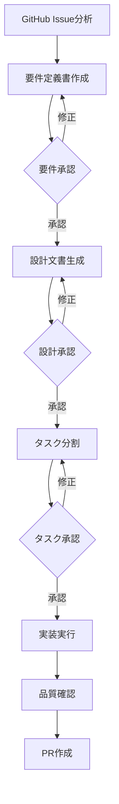

---
allowed-tools:
  - Bash(gh:*)
  - Bash(git:*)
  - Bash(find:*)
  - Bash(grep:*)
  - Bash(ls:*)
  - Bash(cd:*)
  - Task(*)
  - Read(*)
  - Write(*)
  - Edit(*)
  - MultiEdit(*)
  - LS(*)
  - Glob(*)
  - Grep(*)
  - WebFetch(*)
description: Complete workflow to analyze GitHub issue and execute kairo workflow - requirements, design, tasks, and implementation with PR creation
---

# GitHub Issue to PR - Complete Kairo Workflow

GitHub issue のリンクから、issue の内容を読み取り、kairo-requirements → kairo-design → kairo-tasks → kairo-implement の順に実行して、最終的に PR 作成まで行う完全なワークフロー。

## 前提条件

- GitHub CLI (`gh`) が認証済みである
- リポジトリにプッシュ権限がある
- kairo コマンド群 (kairo-requirements, kairo-design, kairo-tasks, kairo-implement) が利用可能である
- 入力として GitHub issue URL が提供されている: {{issue_url}}

## ワークフロー概要



## 実行手順

### Phase 1: GitHub Issue 分析とコンテキスト収集

**1. リポジトリ状態の確認**

```bash
# 現在のブランチとリポジトリ状態を確認
git branch --show-current
git status --porcelain
git log --oneline -5

# GitHub CLI認証状態の確認
gh auth status
gh repo view
```

**2. Issue 情報の取得**

issue URL から issue 番号を抽出: `{{issue_url}}`

```bash
# Issue詳細情報を取得
gh issue view <ISSUE_NUM> --json title,body,labels,assignees,state,url,author
gh issue view <ISSUE_NUM> --comments
```

**3. Issue 内容の分析**

- Issue title、description、comments から要件を抽出
- Labels、assignees から優先度や作業者を確認
- 関連する PR や issue がないかチェック
- 作業ブランチ名を決定: `issue-<ISSUE_NUM>-<descriptive-name>`

### Phase 2: Kairo Requirements - 要件定義

**kairo-requirements コマンドの実行**

Issue から抽出した情報を基に要件定義書を作成:

```bash
# Task toolを使ってkairo-requirementsを実行
# Issue内容を要件として渡す
```

**期待される成果物:**

- `docs/spec/{issue-要件名}-requirements.md`
- EARS 記法による詳細な要件定義
- ユーザーストーリー
- 機能要件・非機能要件
- 受け入れ基準

**承認プロセス:**

- 生成された要件定義書をユーザーに提示
- 修正が必要な場合は要件定義書を更新
- 承認を得てから次のフェーズに進む

### Phase 3: Design - 設計文書生成

**kairo-design コマンドの実行**

ARCHITECTURE.md を参考に、プロジェクトの概観を把握したうえで、承認された要件定義書を基に技術設計を行う:

### Phase 4: Kairo Tasks - タスク分割

**kairo-tasks コマンドの実行**

承認された設計文書を基に実装タスクを分割:

```bash
# Task toolを使ってkairo-tasksを実行
# 設計文書を参照してタスク分割を行う
```

**期待される成果物:**

- `docs/tasks/{要件名}-tasks.md`
- 依存関係を考慮したタスク一覧
- TDD/DIRECT プロセスの割り当て
- 実装詳細・テスト要件・UI/UX 要件
- 実行スケジュール（Gantt chart）

**承認プロセス:**

- 生成されたタスク一覧をユーザーに提示
- タスクの粒度や順序について確認
- 修正が必要な場合はタスク分割を調整
- 承認を得てから次のフェーズに進む

### Phase 5: ブランチ作成と環境準備

**作業ブランチの作成**

```bash
git checkout {{base_branch}}
git pull origin {{base_branch}}

# 作業ブランチを作成
git checkout -b develop/<ISSUE_NUM>/<descriptive-name>
```

**環境の準備**

- 必要な依存関係のインストール
- 開発環境のセットアップ
- 初期テストの実行で環境確認

### Phase 6: Kairo Implement - 実装実行

**kairo-implement コマンドの実行**

タスク一覧に従って順次実装を行う:

```bash
# Task toolを使ってkairo-implementを実行
# 全タスクまたは指定されたタスクを実装
```

**実装中の確認:**

- 各タスク完了後にタスクファイルのチェックボックスを更新
- テスト結果とカバレッジの確認
- コード品質チェック (lint, typecheck 等)
- 進捗状況の報告

### Phase 7: 品質確認と最終検証

**1. コード品質チェック**

```bash
# Linting and formatting
npm run lint 2>/dev/null || yarn lint 2>/dev/null || echo "No lint script found"
npm run format 2>/dev/null || yarn format 2>/dev/null || echo "No format script found"

# Type checking
npm run typecheck 2>/dev/null || yarn typecheck 2>/dev/null || npx tsc --noEmit 2>/dev/null || echo "No typecheck available"

# Tests
npm test 2>/dev/null || pnpm test 2>/dev/null || echo "No test script found"
```

**2. 実装完了確認**

- 全タスクが完了しているかチェック
- Issue の受け入れ基準が満たされているか確認
- 関連するドキュメントが更新されているか確認

**3. 手動テスト**

- 主要な機能が期待通り動作するかテスト
- エラーハンドリングが適切に動作するかテスト
- UI/UX が設計通りになっているかテスト

### Phase 8: Commit と PR 作成

**1. 変更のコミット**

```bash
# ステージングと差分確認
git add .
git status
git diff --cached

# コミット作成 (Issue番号を含む)
git commit -m "feat: implement #<ISSUE_NUM> - <summary>

- 要件定義から設計、実装まで完了
- 全タスクが完了し品質チェックも通過
- Issue #<ISSUE_NUM> の受け入れ基準を満たす

🤖 Generated with [Claude Code](https://claude.ai/code)

Co-Authored-By: Claude <noreply@anthropic.com>"
```

**2. ブランチプッシュ**

```bash
# リモートにプッシュ
git push -u origin develop/<ISSUE_NUM>/<descriptive-name>
```

**3. Pull Request 作成**

gh pr create コマンドを用いて、Pull Request を作成してください。ただし、PULL_REQUEST_TEMPLATE.md のフォーマットは遵守すること。
PR は、origin にて、develop/<ISSUE_NUM>/<descriptive-name>ブランチの分岐元ブランチに向けて作成すること。

## 成功基準

- ✅ GitHub Issue の内容を正しく理解し要件定義に反映
- ✅ EARS 記法による詳細な要件定義書の作成
- ✅ 包括的な技術設計文書の生成
- ✅ 実装可能な粒度でのタスク分割
- ✅ TDD/DIRECT プロセスによる高品質な実装
- ✅ 全テストが通る実装
- ✅ コード品質チェックが全て通る
- ✅ Issue の受け入れ基準を満たす
- ✅ 適切なドキュメントの更新
- ✅ レビュー可能な PR の作成

## エラーハンドリング

**Issue 取得エラー:**

- Issue 番号が無効な場合は適切なエラーメッセージを表示
- プライベートリポジトリのアクセス権限確認

**要件/設計/タスク承認エラー:**

- ユーザーが承認しない場合は該当フェーズに戻る
- 修正指示がある場合は内容を反映して再生成

**実装エラー:**

- テスト失敗時は詳細なエラー情報を表示
- 依存関係エラーは解決方法を提案
- コード品質エラーは修正箇所を特定

**PR 作成エラー:**

- ブランチ名の重複は自動で連番付与
- PR 作成権限がない場合は適切なエラーメッセージ

## 実行例

```bash
# GitHub Issue URLを指定してワークフロー実行
$ claude code github-issue-workflow --issue https://github.com/owner/repo/issues/123

# 特定のフェーズから開始 (途中から再開)
$ claude code github-issue-workflow --issue https://github.com/owner/repo/issues/123 --start-from design

# 自動承認モード (承認を求めずに進める - 注意して使用)
$ claude code github-issue-workflow --issue https://github.com/owner/repo/issues/123 --auto-approve
```

## 出力ファイル構成

```
docs/
├── spec/
│   └── {要件名}-requirements.md
├── design/
│   └── {要件名}/
│       ├── architecture.md
│       ├── dataflow.md
│       ├── interfaces.ts
│       ├── database-schema.sql
│       └── api-endpoints.md
└── tasks/
    └── {要件名}-tasks.md

[実装されたソースコードファイル群]
```

## 実行後の確認

- 作成された PR の URL を表示
- 実装サマリーを表示 (ファイル数、テスト数、カバレッジ等)
- 次のステップ (レビュー依頼等) を提案
- Issue クローズの確認

**🚀 GitHub Issue #{{issue_url}} の完全実装ワークフローを開始します！**
